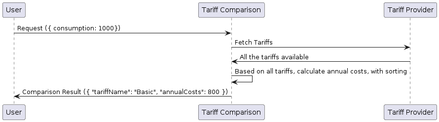
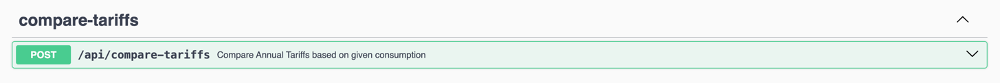
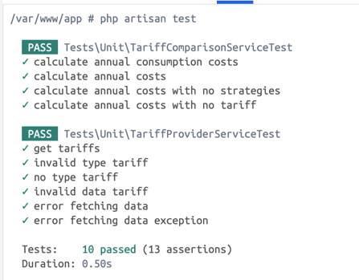

# Electricity Tariff Comparison Platform

This platform allows users to compare electricity prices and estimate their annual costs based on their consumption.
The platform uses [an external provider of electricity tariffs](https://github.com/treadyaparna/vx-tariff-provider) to fetch all available tariffs to accurate pricing information.


### Tariff Provider Service

GitHub Repository: https://github.com/treadyaparna/vx-tariff-provider

The platform receives tariff data in the following format:

```json
[
   {
      "name":"Product A",
      "type":1,
      "baseCost":5,
      "additionalKwhCost":22
   },
   {
      "name":"Product B",
      "type":2,
      "includedKwh":4000,
      "baseCost":800,
      "additionalKwhCost":30
   },
   "..."
]

```

## Business Requirements

Develop a microservices that 
- reads tariffs from the "Tariff Provider Service", 
- performs the calculations, and 
- returns the results based on user input (consumption in kWh/year).
- and the results will be sorted by costs in ascending order.

## Use Case

Calculation Model,

- **Product A Type: 1 - Basic Tariff**
  
  Calculation: base costs per month are 5 € + consumption costs 22 cents/kWh.
  
  _Examples_:
  - Consumption: 3500 kWh/year => Annual costs = 830 €/year (5€ * 12 months = 60 € base costs + 3500 kWh/year * 22 cent/kWh = 770 € consumption costs)
  - Consumption: 4500 kWh/year => Annual costs = 1050 €/year (5€ * 12 months = 60 € base costs + 4500 kWh/year * 22 cent/kWh = 990 € consumption costs)

- **Product B Type: 2 - Packaged Tariff**

  Calculation: 800 € for up to 4000 kWh/year and above 4000 kWh/year, additionally 30 cents/kWh.
  
  _Examples_:
  - Consumption: 3500 kWh/year => Annual costs = 800 €/year
  - Consumption: 4500 kWh/year => Annual costs = 950 €/year (800€ + 500 kWh * 30 cent/kWh = 150 € additional consumption costs)


**Input:**

```json
{
   "consumption":4500
}
```

**Output:**

```json
[
   {
      "tariffName":"Product B",
      "annualCost":950
   },
   {
      "tariffName":"Product A",
      "annualCost":1050
   }
]
```

## Functional Requirements

- The service must fetch electricity tariff information from an external provider.
- The service should calculate annual costs based on user input consumption and tariff details.
- The service must compare tariffs and return results sorted by annual costs in ascending order.
- The service should validate user input to ensure it falls within acceptable ranges.
- The service should provide API documentation for the available endpoints.
- The service should be tested to ensure that it functions as expected and meets quality standards.
- The service should be containerized for easy deployment and scalability.
- The service should be documented to facilitate maintenance and future development.

## Sequence Diagram

The following sequence diagram illustrates the flow of the tariff comparison process:




## Technologies Used

The project is built using the following technologies:

- [PHP 8.2](https://www.php.net/releases/8.2/en.php)
- [Laravel 10](https://laravel.com/)
- [MySQL](https://www.mysql.com/)
- [Docker](https://www.docker.com/), [Docker Compose](https://docs.docker.com/compose/), [Alpine Docker Image](https://hub.docker.com/_/alpine)
- [Nginx](https://www.nginx.com)
- [Composer](https://getcomposer.org/)
- [Swagger](https://swagger.io/)
- [PHPUnit 10](https://phpunit.de/)
- [Makefile](https://makefiletutorial.com/)


## Configuration

Adjust the configuration in the `.env.example` file to suit your requirements before initiate the project setup.

## Set Up Instructions

Before you start, ensure you've [Docker](https://www.docker.com/products/docker-desktop/), `docker-compose` installed and running on your system.

**Step-1:** To set up the project:

- Clone the repository to your local machine.
- Navigate to the project's folder.
- Create a `.env` file for the Laravel environment based on the `.env.example` file located in the source (`src`)
  folder.
- Build Docker containers: `docker-compose build`
- Start Docker containers: `docker-compose up -d`


**Step-2:** Once the project container is ready, run these commands inside the `php` container:

Run command `docker exec -it php /bin/sh` to access the `php` container.

- Install dependencies: `composer install`
- Set directory permissions for the `storage` folder: `chmod -R 777 storage`
- Generate the application key if not already set: `php artisan key:generate`
- Generate the JWT secret key `php artisan jwt:secret`
- (Optional) Regenerate Composer autoload files: `composer dump-autoload`


**Alternatively**, you can install `make` and run the make commands mentioned in the `Makefile` to set up the project quickly.

```
make run-setup
```

## Endpoints

As per functional requirements, the following API endpoints are available:

`POST /api/compare-tariffs`: Compare annual tariffs based on the given consumption.

## API Documentation

The API documentation is generated using Swagger. To access the API documentation, ensure that the project is running and that the Swagger API documentation has already been generated.

- Ensure the project is running.

- Verify if the Swagger API documentation is generated. If not, regenerate it by running the following command:

```
php artisan l5-swagger:generate
```

**Alternatively**, run `make run-docs` command.

By default, you can access the Swagger API documentation at the following URL: http://localhost:8001/api/documentation 

Simply open the URL in your web browser to explore the API documentation and interact with the endpoints.



## Running Tests

To validate the functionality and ensure code quality, execute the following command within the `php` container:

```
php artisan test
```

This command initiates the test suite, running all defined tests to verify that the application behaves as expected and meets quality standards.




## Contact

If you have any questions or feedback, please reach out to me: **Aparna Saha** ([LinkedIn](https://www.linkedin.com/in/aparnasaha/))

## License

This project is licensed under the MIT License (see [LICENSE](LICENSE.md) file).


## Appendix

### Integration Guide: Adding New Tariffs

To seamlessly integrate additional tariffs into the system, follow these steps:

- Generate a new DTO class within `Services/Clients/TariffProviders/DataTransferObjects` to encapsulate tariff details.
- Modify the `match()` method within `TariffDTOFactory` to incorporate the new DTO class for mapping tariff details.
- Develop a new class that implements the `TariffInterface`.
- Implement the `supports` method to verify if the tariff type is supported by the class.
- Implement the `calculateAnnualCost` method to determine the annual cost based on the tariff details and user consumption.
- Register the new tariff class within the `TariffComparisonServiceProvider` to enable its usage within the system.

By adhering to these steps and leveraging the strategy design pattern, to enhance the system's flexibility to seamlessly integrate various tariffs.